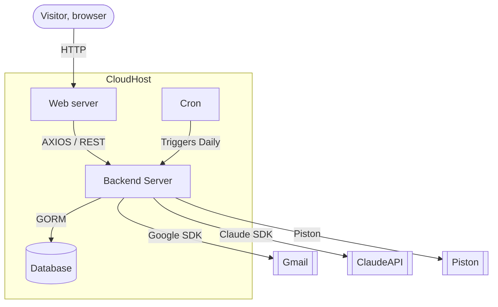

# Daily coding companion Architectural diagram

> [!NOTE] OAuth consent happens directly between the browser and Google, not shown — this diagram covers steady-state API calls only.
> [!NOTE] Piston is self hosted.
