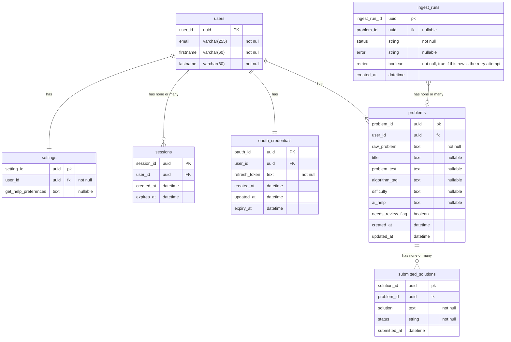

# Daily coding problems ER Diagram

```mermaid
erDiagram
users {
    user_id uuid PK
    email varchar(255) "not null"
    firstname varchar(60) "not null"
    lastname varchar(60) "not null"
}

settings {
    setting_id uuid pk
    user_id uuid fk "not null"
    get_help_preferences text "nullable"
}

sessions {
    session_id uuid PK
    user_id uuid FK
    created_at datetime
    expires_at datetime
}

oauth_credentials {
    oauth_id uuid PK
    user_id uuid FK
    refresh_token text "not null"
    created_at datetime
    updated_at datetime
    expiry_at datetime
}

problems {
    problem_id uuid pk
    user_id uuid fk
    raw_problem text "not null"
    title text "nullable"
    problem_text text "nullable"
    algorithm_tag text "nullable"
    difficulty text "nullable"
    ai_help text "nullable"
    needs_review_flag boolean
    created_at datetime
    updated_at datetime
}

submitted_solutions {
    solution_id uuid pk
    problem_id uuid fk
    solution text "not null"
    status string "not null"
    submitted_at datetime
}

ingest_runs {
    ingest_run_id uuid pk
    problem_id uuid fk "nullable"
    status string "not null"
    error string "nullable"
    retried boolean "not null, true if this row is the retry attempt"
    created_at datetime
}

users ||--o{ sessions : "has none or many"
users ||--|| oauth_credentials : "has"
users ||--|{ problems: "has"
users ||--|| settings: "has"
ingest_runs }|--o| problems : "has none or many"
problems ||--o{ submitted_solutions: "has none or many"
```
