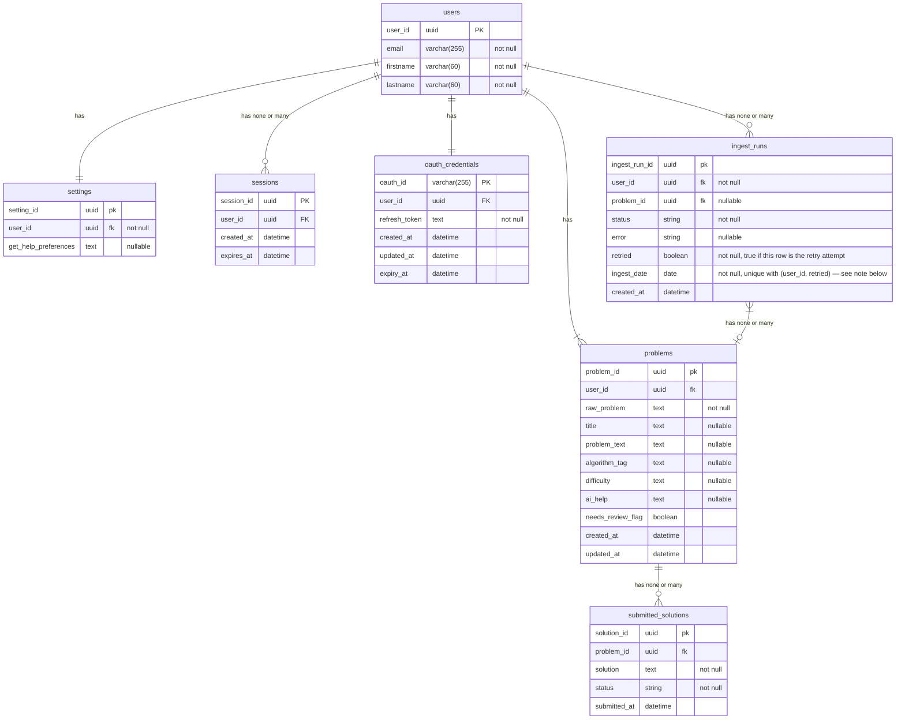

# Daily coding problems ER Diagram

**`ingest_runs` unique constraint:** `(user_id, ingest_date, retried)` is unique. Prevents
two concurrent `/problems/today` requests (two tabs, a reload race) from both invoking
ingest at once — the second insert fails at the DB level instead of silently duplicating
the fetch or the `problems` row. Still allows the legitimate pair of rows per user per
day: one `retried = false` (cron) and one `retried = true` (the retry).

**`oauth_credentials.oauth_id`:** deliberately *not* a self-generated uuid like every other
PK in this schema — it's Google's own `sub` claim from the verified `id_token` (OIDC's
stable, permanent per-account identifier), stored as `varchar(255)` to match what the spec
actually guarantees (a string, not necessarily a fixed-width integer). Existence checks on
sign-in go through this table by `oauth_id`, not through `users` by email — email can
change, `sub` can't. A first-time sign-in creates both the `users` row and this
`oauth_credentials` row together; a returning user's `oauth_id` lookup here is what finds
their existing `users.user_id` via the FK.
