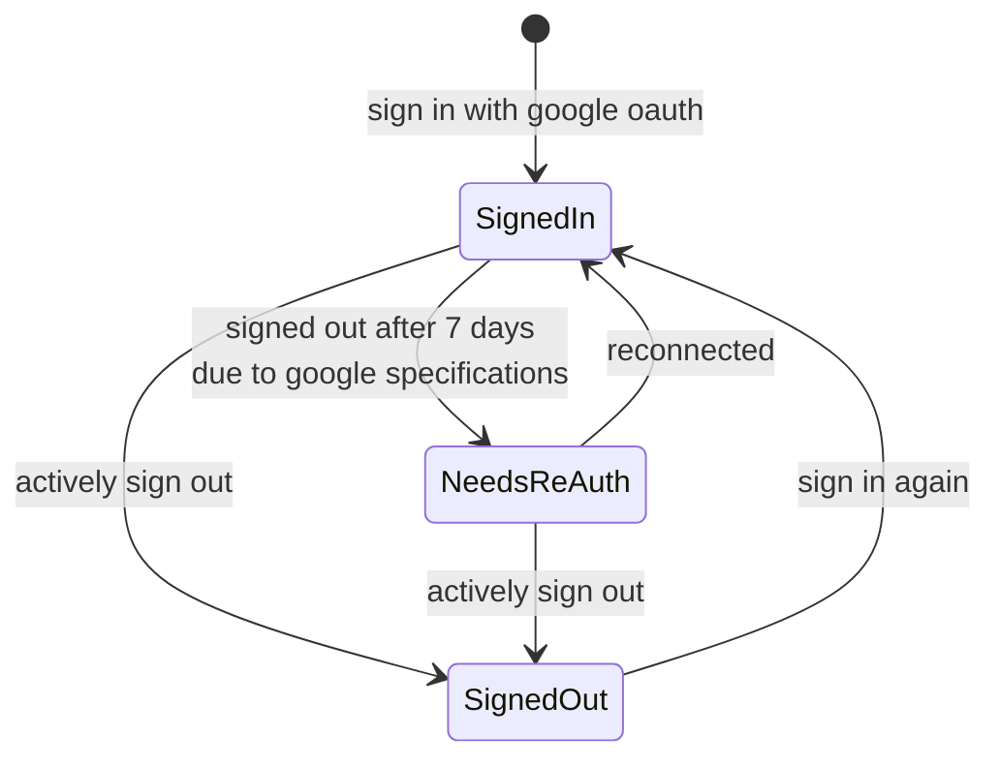
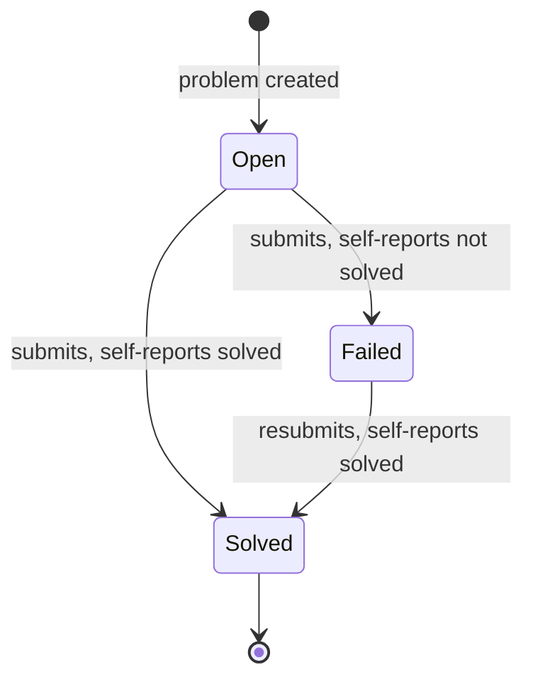
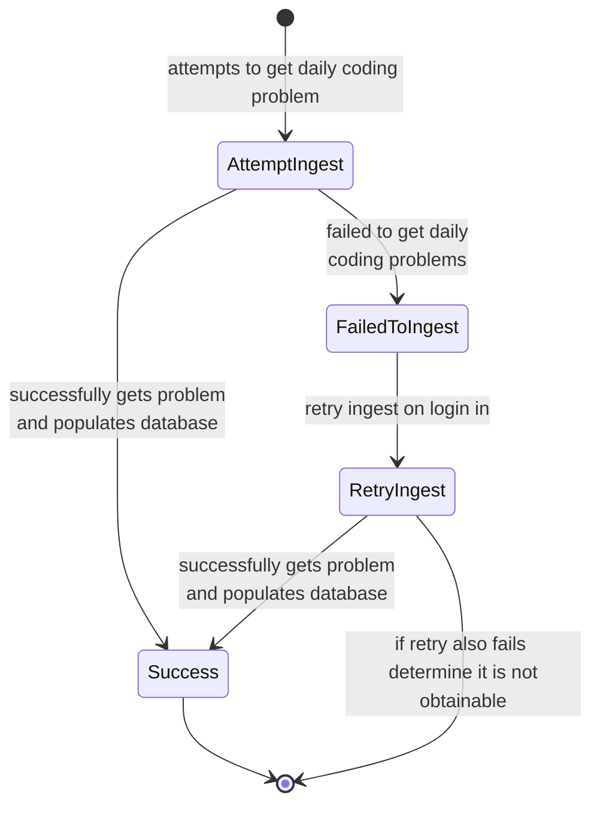

**Daily coding problem state diagram**

## Auth/Session state diagram

## Daily problem state diagram

"Never touched" isn't a state — it's a derived view (an `Open` problem with zero submission
rows). Nothing transitions a problem there or out of it; it just is, until a real submission
event happens.

## Ingest Failure

