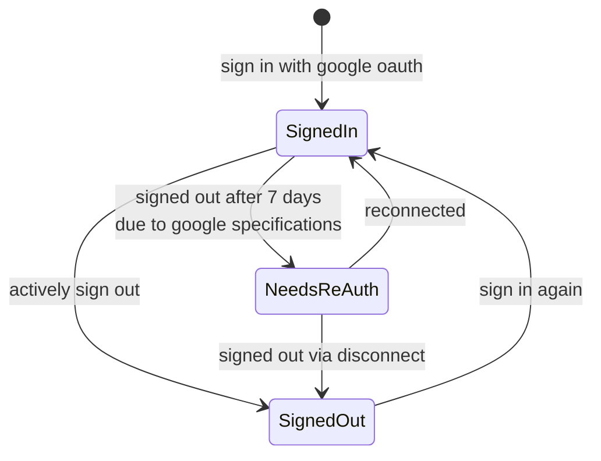
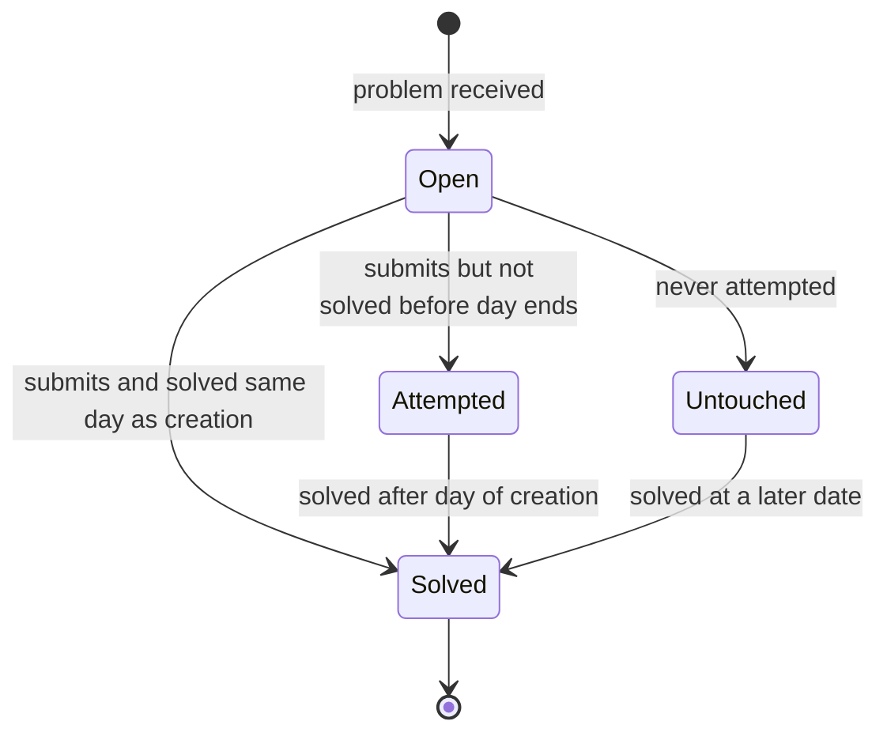
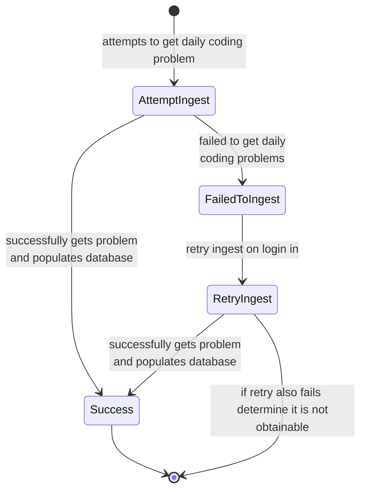

**Daily coding problem state diagram**

## Auth/Session state diagram

```mermaid
stateDiagram-v2
[*] --> SignedIn : sign in with google oauth
SignedIn --> SignedOut : actively sign out
SignedIn --> NeedsReAuth : signed out after 7 days <br> due to google specifications
NeedsReAuth --> SignedOut : signed out via disconnect
NeedsReAuth --> SignedIn : reconnected
SignedOut --> SignedIn : sign in again
```

## Daily problem state diagram

```mermaid
stateDiagram-v2
[*] --> Open : problem received
Open --> Attempted : submits but not <br> solved before day ends
Open --> Solved : submits and solved same day as creation
Attempted --> Solved: solved after day of creation
Open --> Untouched : never attempted
Untouched --> Solved : solved at a later date
Solved --> [*]
```

## Ingest Failure

```mermaid
stateDiagram-v2
[*] --> AttemptIngest : attempts to get daily coding problem
AttemptIngest --> Success : successfully gets problem <br> and populates database
AttemptIngest --> FailedToIngest : failed to get daily <br> coding problems 
FailedToIngest --> RetryIngest : retry ingest on login in
RetryIngest --> Success : successfully gets problem <br> and populates database
RetryIngest --> [*] : if retry also fails <br> determine it is not obtainable
Success --> [*]
```
